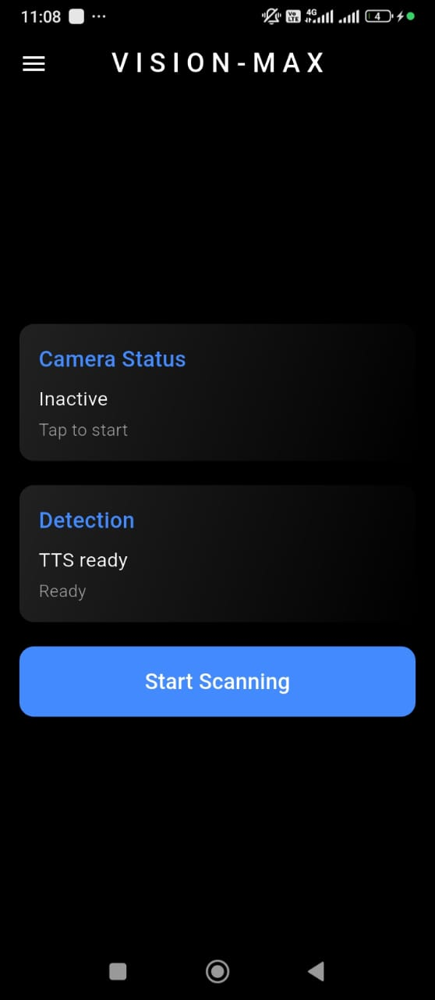
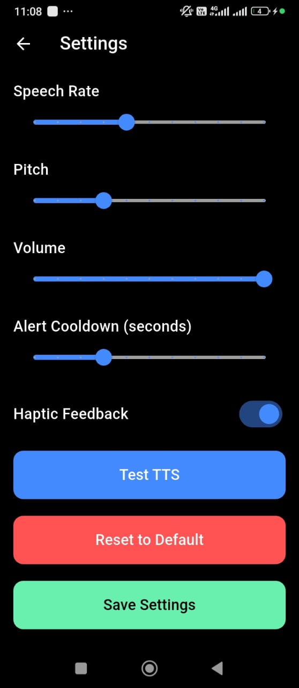

# VisionMax

VisionMax is a Flutter-based assistive application designed to help visually impaired users navigate their surroundings safely. The app uses **Google ML Kit’s Object Detection API** to detect nearby objects and provides **audio and haptic feedback** to guide users.

---

## Key Features

- Real-time object detection using device camera  
- Audio alerts announcing detected objects  
- Haptic feedback for safe navigation  
- Lightweight and optimized for fast, offline performance  

---

## Demo / Screenshots

You can view the app interface and functionality through the screenshots below:

  
  
  

---

## Purpose & Impact

VisionMax enables visually impaired users to explore their environment independently, enhancing safety and mobility using on-device machine learning.

---

## Notes

- This repository contains screenshots and project overview only.  
- Source code is not included.
